## EcomKMP - Multiplatform E-Commerce App

  <p align="left"> A e-commerce app built using Compose Multiplatform for Android and iOS </p>

  <p align="left">
      <a href = "https://github.com/JetBrains/compose-multiplatform/releases">
        
      </a>
      <a href="https://kotlinlang.org/docs/releases.html">
        
      </a>
  </p>

### ⚒️ Architecture

EcomKMP follows the principles of Clean Architecture.

### 👨‍💻 Tech stack

| Tools                 |                                     Link                                                                  |
|:----------------------|:---------------------------------------------------------------------------------------------------------:|
| 🤖  Language          |                       [Kotlin](https://kotlinlang.org)                                                    |
| 🩶  Framework         |  [Compose Multiplatform](https://www.jetbrains.com/lp/compose-multiplatform)                              |
| 💉  DI                |          [Koin](https://insert-koin.io/docs/reference/koin-mp/kmp/)                                       |
| 🧭  Navigation        |        [Tlaster / PreCompose](https://github.com/Tlaster/PreCompose)                                      |
| 🧶  Multi-threading   |     [Kotlin Coroutines](https://developer.android.com/kotlin/coroutines)                                  |


### 📹 Video


### 🖥️  Screenshots

#### Android
<table style="width:100%">
  <tr>
    <th>Home</th>
    <th>Home Scrolled</th>
    <th>Shop</th>
    <th>Bag</th>
    <th>Favorite</th>
    <th>Profile</th>
  </tr>
  <tr>
    <td>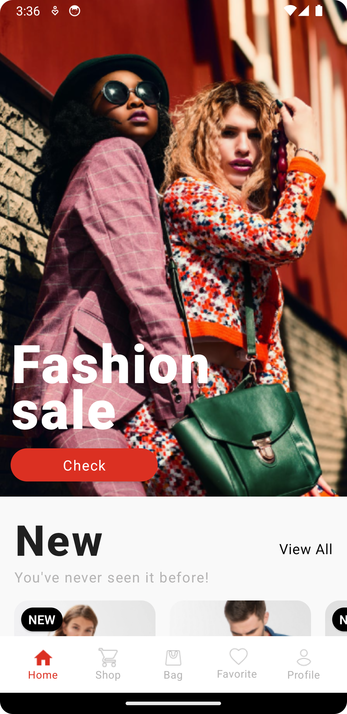</td>
    <td></td>
    <td>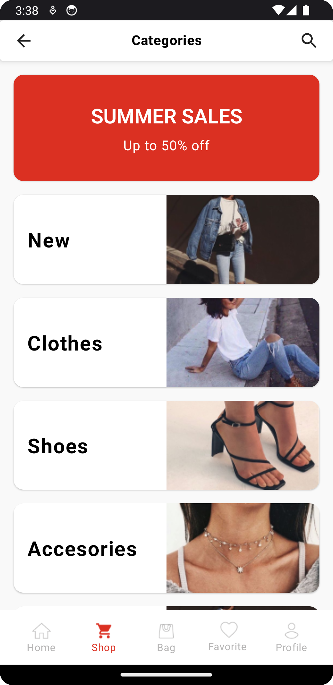</td>
    <td>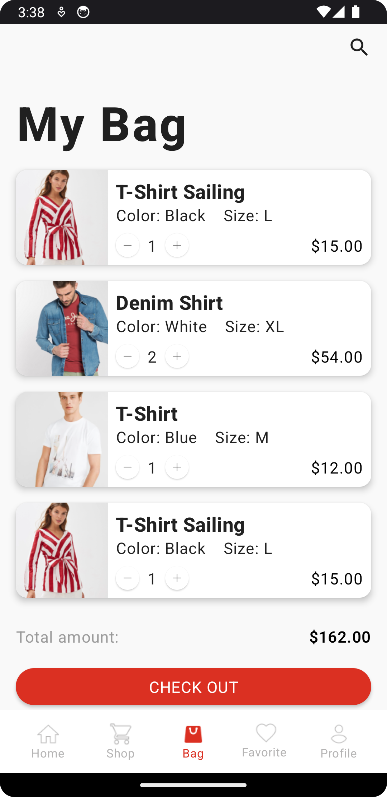</td>
    <td>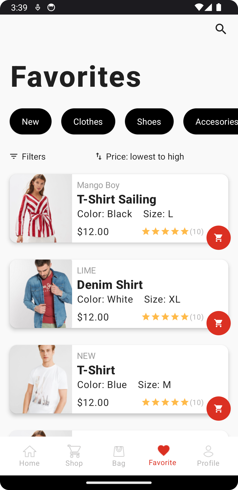</td>
    <td>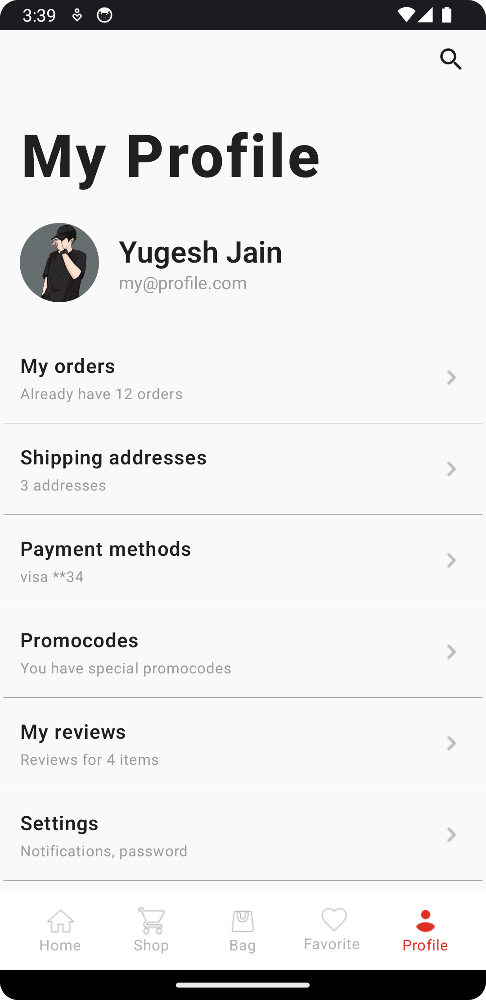</td>
  </tr>
</table>


#### IOS
<table style="width:100%">
  <tr>
    <th>Home</th>
    <th>Home Scrolled</th>
    <th>Shop</th>
    <th>Bag</th>
    <th>Favorite</th>
    <th>Profile</th>
  </tr>
  <tr>
    <td>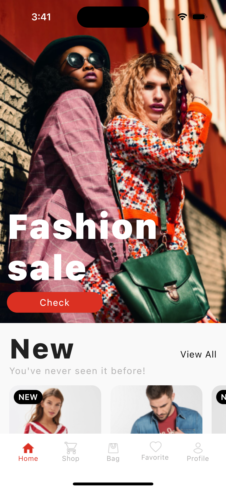</td>
    <td>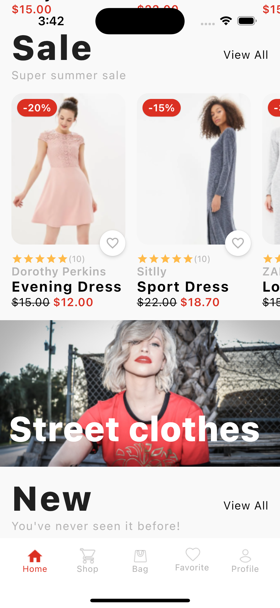</td>
    <td>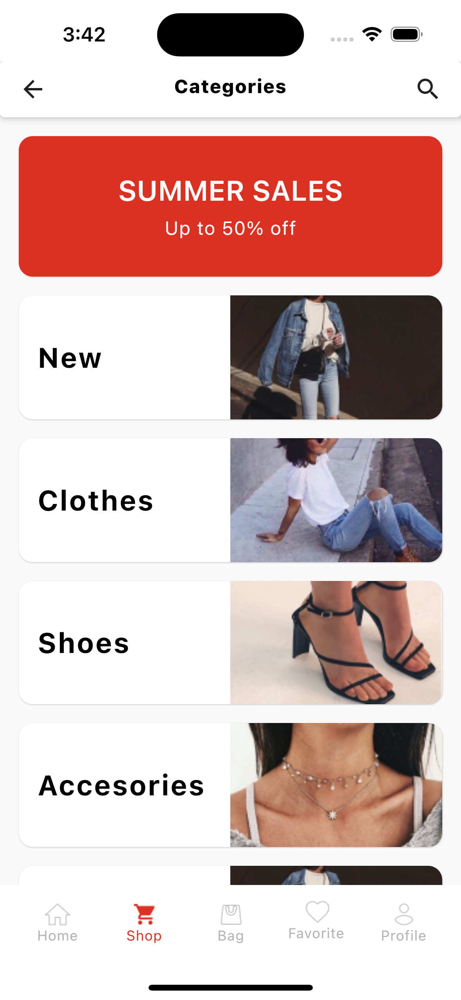</td>
    <td>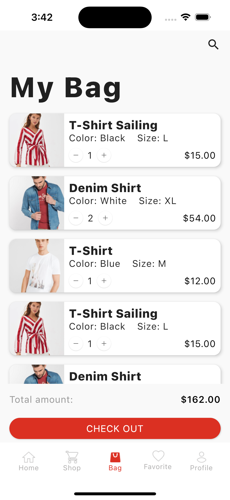</td>
    <td>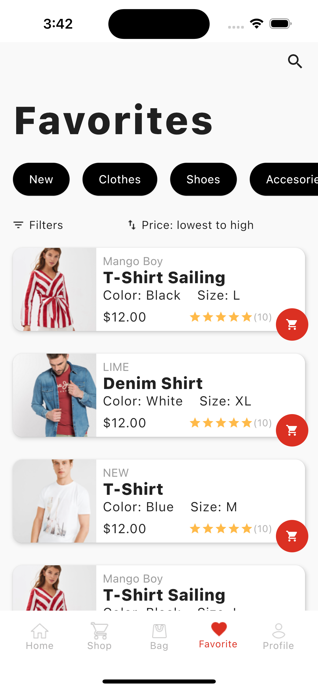</td>
    <td>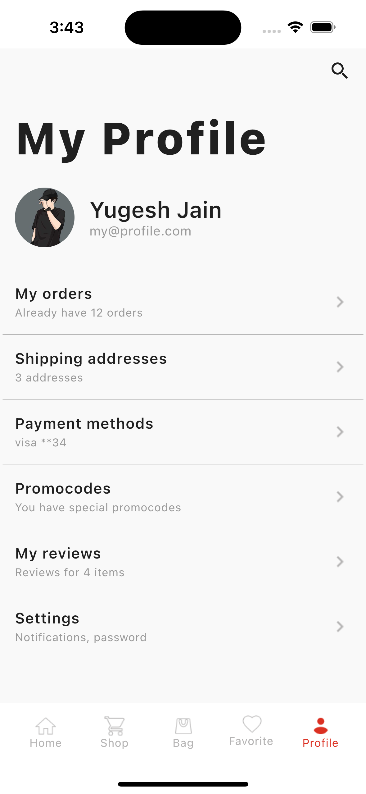</td>
  </tr>
</table>

### How to run the project? ✅

To run this project, you need the following:

* A machine running a recent version of macOS
* [Xcode](https://apps.apple.com/us/app/xcode/id497799835)
* [Android Studio](https://developer.android.com/studio)
* The [Kotlin Multiplatform Mobile plugin](https://plugins.jetbrains.com/plugin/14936-kotlin-multiplatform-mobile)
* The [CocoaPods dependency manager](https://kotlinlang.org/docs/native-cocoapods.html)

### Check your environment

Before you start, use the [KDoctor](https://github.com/Kotlin/kdoctor) tool to ensure that your development environment is configured correctly:

1. Install KDoctor with [Homebrew](https://brew.sh/): ``brew install kdoctor``

2. Run KDoctor in your terminal: ``kdoctor``

   If everything is set up correctly, you'll see valid output:

   ```text
   Environment diagnose (to see all details, use -v option):
   [✓] Operation System
   [✓] Java
   [✓] Android Studio
   [✓] Xcode
   [✓] Cocoapods
   
   Conclusion:
     ✓ Your system is ready for Kotlin Multiplatform Mobile development!
   ```

Otherwise, KDoctor will highlight which parts of your setup still need to be configured and will suggest a way to fix them.

## Understanding the project structure

Open the project in Android Studio and switch the view from **Android** to **Project** to see all the files and targets belonging to the project:

Your Compose Multiplatform project includes 3 modules:

### shared

This is a Kotlin module that contains the logic common for both Android and iOS applications, that is, the code you share between platforms.

This `shared` module is also where you’ll write your Compose Multiplatform code.
In `shared/src/commonMain/kotlin/App.kt`, you can find the shared root `@Composable` function for your app.

It uses Gradle as the build system. You can add dependencies and change settings in `shared/build.gradle.kts`.
The `shared` module builds into an Android library and an iOS framework.

### androidApp

This is a Kotlin module that builds into an Android application. It uses Gradle as the build system.
The `androidApp` module depends on and uses the `shared` module as a regular Android library.

### iosApp

This is an Xcode project that builds into an iOS application.
It depends on and uses the `shared` module as a CocoaPods dependency.

## Run your application

### On Android

To run your application on an Android emulator:

1. Ensure you have an Android virtual device available. Otherwise, [create one](https://developer.android.com/studio/run/managing-avds#createavd).
2. In the list of run configurations, select `androidApp`.
3. Choose your virtual device and click **Run**

### On iOS

#### Running on a simulator

To run your application on an iOS simulator in Android Studio, modify the `iosApp` run configuration:

1. In the list of run configurations, select **Edit Configurations**
2. Navigate to **iOS Application** | **iosApp**.
3. In the **Execution target** list, select your target device. Click **OK**.
4. The `iosApp` run configuration is now available. Click **Run** next to your virtual device.

> **Note**
> Before you continue, we suggest creating a simple "Hello, world!" project in Xcode to ensure you can successfully run apps on your device.
> You can follow the instructions below or watch this [Stanford CS193P lecture recording](https://youtu.be/bqu6BquVi2M?start=716&end=1399).

<details>
<summary>How to create and run a simple project in Xcode</summary>

1. On the Xcode welcome screen, select **Create a new project in Xcode**.
2. On the **iOS** tab, choose the **App** template. Click **Next**.
3. Specify the product name and keep other settings default. Click **Next**.
4. Select where to store the project on your computer and click **Create**. You'll see an app that displays "Hello, world!" on the device screen.
5. At the top of your Xcode screen, click on the device name near the **Run** button.
6. Plug your device into the computer. You'll see this device in the list of run options.
7. Choose your device and click **Run**.

</details>

## Design 

Designed by [Hitesh Tapaniya](https://www.figma.com/@hiteshbenzatine). [E-Commerce App Design](https://www.figma.com/community/file/1131440097475381135)


## Find this project useful ? ❤️

- Support it by clicking the ⭐️ button on the upper right of this page. ✌️

# License
```markdown
Copyright 2023 Yugesh Jain

Licensed under the Apache License, Version 2.0 (the "License");
you may not use this file except in compliance with the License.
You may obtain a copy of the License at

   http://www.apache.org/licenses/LICENSE-2.0

Unless required by applicable law or agreed to in writing, software
distributed under the License is distributed on an "AS IS" BASIS,
WITHOUT WARRANTIES OR CONDITIONS OF ANY KIND, either express or implied.
See the License for the specific language governing permissions and
limitations under the License.
```
